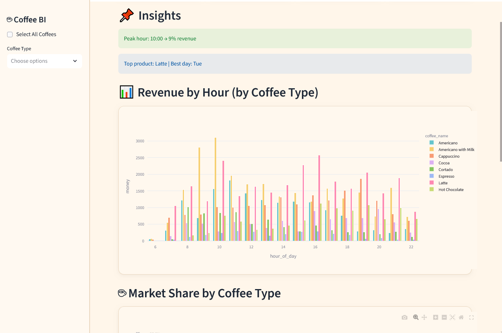

# ☕ Coffee Sales Dashboard

An interactive data analytics dashboard built with **Streamlit** to analyze coffee sales, visualize business performance, and forecast demand using Machine Learning.

---

## 📊 Overview

This project explores coffee sales data to extract business insights such as:

- Revenue performance
- Sales by hour of the day
- Coffee type distribution
- Customer purchasing patterns
- Demand forecasting using ML

---

## 🚀 Live Demo

👉 Streamlit App:  
[Add your Streamlit link here]

---

## 📸 Dashboard Preview

---

## 🧠 Features

- 📈 KPI metrics (Revenue, Average Ticket, Transactions, Peak Hour)
- ☕ Coffee type performance analysis
- ⏰ Hourly sales trends
- 🤖 Demand forecasting model (Random Forest)
- 🎛️ Interactive filters (coffee selection)

---

## 🛠️ Tech Stack

- Python
- Streamlit
- Pandas
- Plotly
- Scikit-learn

---

## 📂 Project Structure
